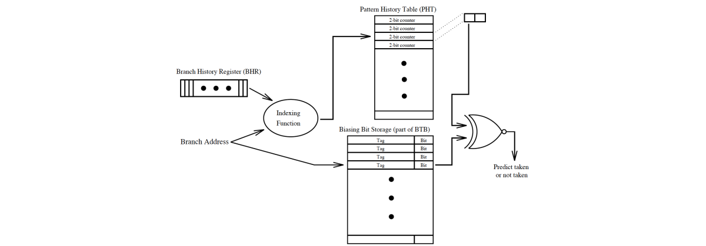
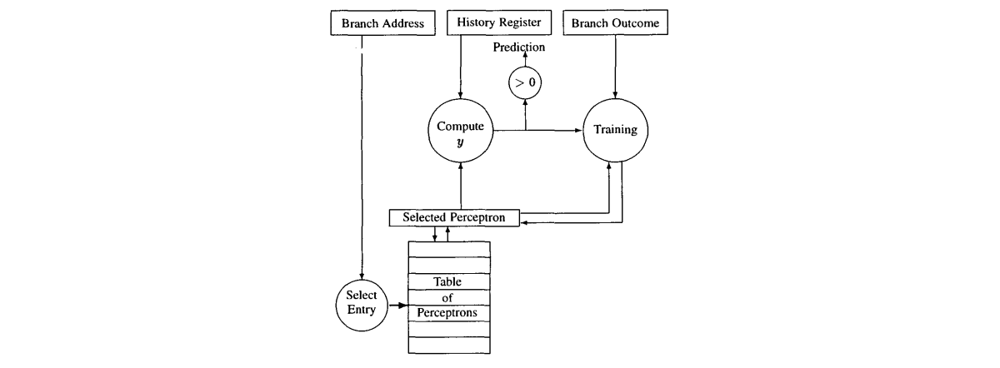

---
papersize:
- a4
fontsize:
- 8pt
geometry:
- margin=0.8in
header-includes:
- \setlength\parindent{0pt}
- \hypersetup{colorlinks=true,urlcolor=blue,pdftitle={Final Project},}
- \usepackage{amsmath}
---

\pagenumbering{arabic}
\setcounter{page}{1}

# Final Project - Advanced Computer Architecture
\begin{center}
Álvaro Galisteo Álvarez - \href{mailto:e11932434@student.tuwien.ac.at}{e11932434@student.tuwien.ac.at}
\end{center}

# Introduction

The objective of this project is to implement two branch predictors, the agree preditor and the perceptron predictor and evaluate their performance in addition to comparing them with other predictors already developed. The predictors were simulated and tested in the gem5 simulator running on an Intel 4 core i5 at 1.60GHz.

# Implementation details

## Agree predictor

The Agree predictor, originally proposed by Eric Sprangle, Robert S. Chappell, Mitch Alsup and Yale N. Pat in _The Agree Predictor: A Mechanism for Reducing Negative Branch History Interference_ is a predictor that uses two tables, a pattern history table, and a biasing bit storage, in which each branch has a bias towards a concrete outcome and where each entry in the PHT associated to a pattern determines if this pattern agrees with the result of the bias. This way, the predictor can reduce negative interference (i.e. where two branches have the same pattern but resolve in different outcomes).

In our implementation, we speculatively fill a branch history register (BHR) which is used, along the LSBs in the branch address, to index the pattern history table (PHT). The LSBs in the branch address are also used to index the biasing bit storage (BBS). Then, the two results are checked (or XNORed) to see if the PHT agrees with the biasing bit and a prediction will be made. This behavior can be found in the function `lookup(...)`.

On the other hand, the PHT entry is increased if the biasing bit and the outcome were the same (i.e. the bias bit was in the right direction) and decremented otherwise. The branch history register is also restored in case a squash occurred and then updated with the outcome. Finally, the biasing bit entry is also updated to the outcome of the branch. This behavior can be found in the function `update(...)`.

Moreover, four variables, the size of the PHT and the BBS, the BHR length, and the saturating counter bits are implemented and to prevent an _index out of range_ error, a bitmask is used, based on the branch history register length.

## Perceptron predictor

The Perceptron predictor, originally proposed by Daniel A. Jiménez and Calvin L. in _Dynamic Branch Prediction with Perceptrons_ is a predictor that uses single perceptrons, stored in a table (PT) addressed by the branch address. As this is a binary classifier with a more sophisticated learning mechanism, it provides better accuracy.

In our implementation, we also speculatively fill a branch history register (BHR) in which _k_ first bits are used as a bias. On the other hand, the branch address is used to index a table of perceptrons. The chosen perceptron is then fed with a biased BHR and outputs a value $y$. If this value is bigger than _0_, the prediction is _taken_ and _not-taken_ otherwise. This behavior can be found in the function `lookup(...)`.

On the other hand, the perceptron is trained with a training function (`perceptron.cc`, `Perceptron::train(...)`) when an update is called. In this training, the perceptron is fed again with the biased BHR, along with the _y_ result, the outcome, and a threshold value. This value is extracted from the original paper and its value is calculated as follows:

$$\text{threshold} = \lfloor 1.93 \times \text{globalHistorySize} + 14 \rfloor$$

The branch history register is also restored in case a squash occurred and then updated with the outcome. This behavior can be found in the function `update(...)`.

To implement a perceptron, a new class, `Perceptron`, was implemented. This class contains two public functions `getPrediction(...)` and `train(...)`, along with a private variable where the weights are stored. The training function can be seen in the code, meanwhile, `getPrediction(...)` returns a value based on the sum of the products between weights and the converted bits, where _1_ is converted into _1_ and _0_ into _-1_.

Moreover, three variables, the size of the PT, the BHR length, and the number of bias bits (which must never exceed $\frac{1}{3}$ of the BHR length) are implemented. Also, to prevent an _index out of range_ error, a bitmask is used, based on the branch history register length.

# Analysis

## Agree predictor

### Table sizes

### Saturating Counter

## Perceptron predictor

### Table sizes

### Biasing Bits

## Comparison

# Conclusion
