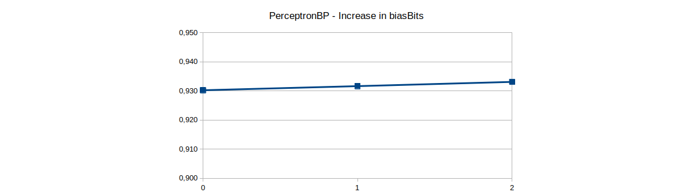

---
papersize:
- a4
fontsize:
- 8pt
geometry:
- margin=0.8in
header-includes:
- \setlength\parindent{0pt}
- \hypersetup{colorlinks=true,urlcolor=blue,pdftitle={Final Project},}
- \usepackage{amsmath}
---

\pagenumbering{arabic}
\setcounter{page}{1}

# Final Project - Advanced Computer Architecture
\begin{center}
Álvaro Galisteo Álvarez - \href{mailto:e11932434@student.tuwien.ac.at}{e11932434@student.tuwien.ac.at}
\end{center}

# Introduction

The objective of this project is to implement two branch predictors, the Agree predictor, and the Perceptron predictor and evaluate their performance besides comparing them with other predictors already developed. The predictors were simulated and tested in the gem5 simulator running on an Intel i5 - 4 core at 1.40GHz.

# Implementation details

## Agree predictor

The Agree predictor, originally proposed by Eric Sprangle, Robert S. Chappell, Mitch Alsup and Yale N. Pat in _The Agree Predictor: A Mechanism for Reducing Negative Branch History Interference_ [6] is a predictor that uses two tables, a pattern history table, and a biasing bit storage, in which each branch has a bias towards a concrete outcome and where each entry in the PHT associated to a pattern determines if this pattern agrees with the result of the bias. This way, the predictor can reduce negative interference (i.e. where two branches have the same pattern but resolve in different outcomes).

As most branches are usually taken, we initialize the predictor with the biasing bit storage table to _0_ and the pattern history table to _00_. That way, when the first prediction needs to be done, the pattern history table will not agree to the value in the biasing bit storage table, therefore the prediction will be _taken_.

In our implementation, we speculatively fill a branch history register (BHR) which is used, along the LSBs in the branch address, to index the pattern history table (PHT). The LSBs in the branch address are also used to index the biasing bit storage (BBS). Then, the two results are checked (with an XNOR operation or boolean equality) to see if the PHT agrees with the biasing bit and a prediction will be made. This behavior can be found in the function `AgreeBP::lookup(...)`.

To update the predictor, first, the PHT entry is increased if the biasing bit and the outcome were the same (i.e. the bias bit was in the right direction) and decremented otherwise. The branch history register is also restored in case a squash occurred and it is then updated with the outcome in all cases. Finally, the biasing bit entry is also updated to the outcome of the branch, but only the first time the branch is encountered. This also allows for new branches to overwrite the BBS entry of branches that no longer are in execution. This behavior can be found in the function `AgreeBP::update(...)`.

Moreover, four variables, the size of the PHT and the BBS, the BHR length, and the saturating counter bits are implemented and to prevent _index out of range_ errors, bitmasks are used, based on the branch history register length and table sizes.

## Perceptron predictor

The Perceptron predictor, originally proposed by Daniel A. Jiménez and Calvin L. in _Dynamic Branch Prediction with Perceptrons_ [7] is a predictor that uses single perceptrons, stored in a table (PT) addressed by the branch address. As this is a binary classifier [5] with a more sophisticated learning mechanism, it provides better accuracy.

In our implementation, we also speculatively fill a branch history register (BHR) in which the $0 \leq k \leq \lfloor \frac{globalHistorySize}{3} \rfloor$ first bits are used as a bias, with a value of _1_. On the other hand, the LSBs of the branch address are used to index a table of perceptrons. The chosen perceptron is then fed with the biased BHR and outputs a value $y$. If this value is bigger than _0_, the prediction is _taken_ and _not-taken_ otherwise. This behavior can be found in the function `PerceptronBP::lookup(...)`.

On the other hand, the perceptron is trained with a training function found in `Perceptron::train(...)`, when an update is called. In this training, the perceptron is fed again with the biased BHR, along with the _y_ resulting value, the outcome, and a threshold value. This threshold is calculated with the formula obtained by the authors in the original paper [7] and is as follows

$$\text{threshold} = \lfloor 1.93 \times \text{globalHistorySize} + 14 \rfloor$$

The branch history register is also restored in case a squash occurred and then updated with the outcome. This behavior can be found in the function `PerceptronBP::update(...)`.

To implement a perceptron, a new class, `Perceptron`, was implemented. This class contains two public functions `Perceptron::getPrediction(...)` and `Perceptron::train(...)`, along with a private variable where the weights are stored. The function `Perceptron::getPrediction(...)` returns the _y_ value based on the sum of the products between weights and the converted bits, where a _1_ is converted into _1_ and a _0_ into _-1_.

Moreover, three variables, the size of the PT, the BHR length, and the number of biasing bits are implemented. Also, to prevent an _index out of range_ error, a bitmask is used, based on the branch history register length.

\clearpage

# Analysis

The PARSEC benchmark suite, as specified in the project presentation was used. The following benchmarks, which all fall in different categories were used: blackscholes, bodytrack, canneal, dedup, ferret, fluidanimate, freqmine, x264.

Because of limited time and some benchmarks taking too much time to finish, each one was executed with small input sets and limited to 60 minutes of runtime, after which all the statistic files were collected and ROI statistics were analyzed and plotted.

## Agree predictor

To test the Agree predictor, we have proposed the following hypotheses:

1. The larger the tables, the greater the accuracy.
2. The branch history register has the same influence on selecting the entry in the pattern table as the branch direction.
3. The higher the number of bits in the saturating counter, the higher the accuracy.

With this in mind, we have developed the following tests.

### Table sizes

The first test consists of increasing the size of the pattern and bias tables, together with a length of the branch history register equal to the exponent of the size of the tables, that is,

$$tableSize = 2 ^ {globalHistorySize}$$

The second test is to increase the size of the pattern and bias tables, but to check the influence of the branch direction, we have reduced the size of the branch history register by two bits, so that the 2 MSB of the index to the pattern table belong to the branch direction, that is,

$$tableSize = 2 ^ {globalHistorySize + 2}$$

In Figure 3 we can see that, as stated, increasing the size of the tables produces an improvement in the predictor's accuracy. This is because the small size tables still have interference although it affects less and, although the Agree predictor aims to reduce negative interference, it is not feasible to have tables for all possible instructions. 

Likewise, as expected, increasing the size of the tables provides more information to the predictor when making a prediction, as well as a better correlation between branches with similar behavior which map to the same PHT entry, consequently increasing the accuracy.

Again in Figure 3, we can see the results of test 2. We can quickly observe that, in some cases, when the direction of the branch has more "influence", the accuracy improves, however, we find cases where the accuracy has an equal or very similar value and that the results, unlike the first test, do not follow a linear trend.

This may be because sometimes the branch correlation is influenced by both registers equally while in others, this correlation is due in a small major part to the branch direction itself. In conclusion, it cannot be confirmed that the smaller the branch history register size, the more dependent the prediction is in the branch direction.

### Saturating Counter

For this third and final test, we have taken the best configuration in terms of table size and register size from the last two tests, i.e. a table size of $32768$ entries and a history register size of $13$ bits. Next, we have made tests to check the third hypothesis, if the increase of bits in the saturating counter improves the prediction.

In Figure 4 we can see that the accuracy increases to a greater number of bits, but up to some extent. $3$ bits are better than $2$ bits, but $4$ bits fall far below the $2$ bit counter. This is because the saturation counters are not used to make the prediction itself, but are used to check if the branch pattern is agreeing with the bias. Therefore, by increasing the number of bits the counter can become more accurate, however, there is an equilibrium point where the counter takes so long to "agree" with the bias bit that it leads to a worse accuracy in the prediction.

Therefore, we can conclude that, the more bits, the greater the accuracy, but up to a certain point of balance.

\clearpage

## Perceptron predictor

Again, like in the Agree predictor, we propose some hypothesis:

1. The larger the tables, the greater the accuracy.
2. Increasing the number of biasing bits leads to better accuracy.

### Table sizes

The first test was done similarly to the one performed in the Agree predictor. It consists of increasing the size of the, together with a length of the branch history register equal to the exponent of the size of the tables, that is,

$$tableSize = 2 ^ {globalHistorySize}$$

In Figure 5 we can see that the accuracy follows a logarithmic trend which seems to converge to an asymptote around 93% accuracy. We will later analyze this result in comparison with other predictors and present possible solutions and improvements.

Again, similar to the previous predictor, if the number of entries and the length of the history register increases, the accuracy increases, as it would be expected and confirming our hypothesis. This increase in accuracy is because the perceptrons can analyze the behavior of the branches through their training since the bits that have a higher correlation with the branch result will have higher values than the bits with lower correlation. When more bits are available, more correlations can be found. Also, when more perceptrons are in use, less interference occurs, also increasing the accuracy.

On the other hand, this asymptote can be attributed to the training of the perceptrons. These types of perceptrons have a big-O of $O(n)$, so the larger the perceptron inputs, the longer the training time, thus affecting the predictions that can be made in a given period of time.

Therefore, the greater the number of entries and the longer the branch history register, the less interference and the greater the accuracy, but the greater the length is accompanied by a loss of performance if the training is not optimized.

### Biasing Bits

The use of the first $k$ bits as a bias is a feature that we have included. Unlike the paper, where only the first bit is used as bias, we have decided to implement the possibility of increasing or decreasing this amount, to also check if it affects the results in any way.

For this test, we have taken the best configuration in terms of table size and register size from the last tests, i.e. a table size of $32768$ entries and a history register size of $15$ bits.

In figure 5 we can see that by increasing the number of biasing bits in the history register the accuracy does not vary significantly, and even, if we increase the number of biasing bits, the accuracy may worsen.

This can be attributed to the fact that, even though we've provided the perceptron with some bias or "help", the perceptron still finds useful correlations when that first $k$ bits are biased and set to true, and that these biasing bits have little influence on the final prediction.

Moreover, if we increase the number of biased bits, we may reduce the amount of information available to the predictor, thus reducing its accuracy.

In conclusion, increasing the number of biasing bits leads to similar or slightly increased accuracy.

\clearpage

## Comparison

First, we must describe the predictors we will use for comparison and we must take into account their descriptions when analyzing the results. The predictors used are the following, sorted by their year of appearance:

1. **Local**: The Local branch predictor was introduced in 1991 by T. Y. Yeh and Y. N. Patt [3]. in which the history of a recent branch is used to address a pattern table with saturating counters that predict a branch outcome.
2. **Agree**: This branch predictor was introduced in June 1997 by E. Sprangle, R. S. Chappell, M. Alsup, and Y. N. Patt [6] and is designed to improve a common issue in local branch predictors, where negative interference by different branches occur.
3. **BiMode**: BiMode was introduced in December 1997 by C. C. Lee, C. K. Chen and T. N. Mudge [1]. This predictor divides the prediction tables into two halves, dynamically determines the current "mode" of the program and selects the appropriate half of the table for prediction while preserving global history-based prediction and reducing destructive aliasing.
4. **Tournament**: This predictor is used in the Alpha 21264 processor. Introduced by R. E. Kessler [4] in 1999, this predictor makes use of a hybrid approach, with a local history predictor, a global history predictor and a "chooser" that selects depending on the branch which predictor will give the best prediction.
5. **Perceptron**: Introduced in 2001 by D. A. Jimenez and C. Lin [7], this branch predictor makes use of single perceptrons, previously defined as binary classifiers to provide better accuracy with a more sophisticated learning mechanism.
6. **L-TAGE**: L-TAGE was presented in a paper by A. Seznec and P. Michaud [2] in 2006. It relies on several predictor tables indexed through independent functions of the global branch, path history and or the branch address and usually greatly outperforms the rest of the predictors in sheer performance.

Even though _gem5_ has a lot of branch predictors implemented, we choose these predictors are they were the most significant. Every branch predictor was tested in their default configurations and use a similar amount of hardware resources.

From this, we propose the following hypothesis: the most recent predictors will get better accuracy than the older ones.

In Figure 7, we can see that in some cases, the new predictors outperform the old ones, as our hypothesis stated, but we cannot confirm it one hundred percent, as on average, the BiMode predictor outperforms the Tournament and Perceptron predictor.

However, we observe that the Perceptron and Tournament predictors have approximately the same accuracy and are near the BiMode and LTAGE predictors, but, our implementation of the Perceptron predictor sometimes falls behind in a couple of benchmarks. Besides, we have observed that being a more complex predictor, the time to perform the lookups and training is longer than others as stated in its individual test.

Regarding our other implementation, we can see that the Agree predictor improves the local predictor, since, as we have commented before, the Agree predictor tries to avoid negative interferences. However, the improvements don't have a substantial difference.

Another observation we made is that when the branch predictors are more complex, the time they take to make a prediction increases, as more cycles are required to perform lookups and/or training. Improvements in our implementations will be discussed in the conclusions.

It should also be noted that the average accuracy of all predictors is not similar to those shown in their respective papers. This may be because of many reasons, but perhaps the main one is that these researchers used different benchmark suites than those used here and that not all programs can provide a certain performance and variations can be very large, however, these tests may serve as useful approximations.

\clearpage

# Conclusion

We can reach some conclusions by looking at this analysis. We can say that, in general, our implementations require some improvements and optimizations that may not have been conceived during the development of this project, especially in the Perceptron predictor since it is a more complex one.

Going into detail, several improvements can be thought of. With the Agree predictor, it has been observed that when the direction of the branch has (a little) more influence when generating the index for the pattern table, the accuracy slightly increases. Thus, we could implement better functions to smooth the trend line and to generate the index to be used in the pattern table, different from an XOR, such as a hash function, or even a dynamic function where a parameter is "trained" on every branch predictor update, although we must take into account when making these improvements the number of resources that will be used and if some of them are worth sacrificing. 

Other changes we can make may be in the area of the saturating counter, where a different state machine might be ideal. However, as T. Y. Yeh and Y. N. Patt found while testing different implementations of a saturating counter, this type of state machine is the best performing one [3].

Stepping into the Perceptron, an improvement that we can come up with is a better and optimized training function, but taking into account the resource usage. This training function in conjunction with longer branch history registers should help reduce training times and to increase the possible number of predictions that can be done in a given period of time.

Along with a better training function, an indexing function that takes the branch address as input to index the table of perceptrons could be used, since a main difference from the original paper is that our implementation simply uses the LSBs of the branch address to index the table and this function could increase the accuracy.

Finally, we could also make use of longer branch history register lengths, to make better use of the characteristics of a perceptron but again, taking the resource budget into account and implementing it efficiently.

# References

[1] C.-C. Lee, I.-C. K. Chen, and T. N. Mudge, "The bi-mode branch predictor" pp. 4–13, 1997.

[2] A. Seznec and P. Michaud, "A case for (partially) TAgged GEometric history length branch prediction" vol. 8, 2006.

[3] T.-Y. Yeh and Y. Patt, "Two-level adaptive training branch prediction" pp. 51–61, 1991.

[4] R. E. Kessler, "The Alpha 21264 microprocessor" vol. 19, no. 2, pp. 24–36, 1999, doi: 10.1109/40.755465.

[5] Y. Freund and R. Schapire, "Large Margin Classification Using the Perceptron Algorithm" vol. 37, no. 3, pp. 277–296, 1999, doi: 
10.1023/A:1007662407062.

[6] E. Sprangle, R. S. Chappell, M. Alsup, and Y. N. Patt, "The Agree Predictor: A Mechanism For Reducing Negative Branch History Interference" vol. 
25, no. 2. pp. 284–291, 1997.

[7] D. A. Jimenez and C. Lin, "Dynamic branch prediction with perceptrons" pp. 197–206, 2001.
